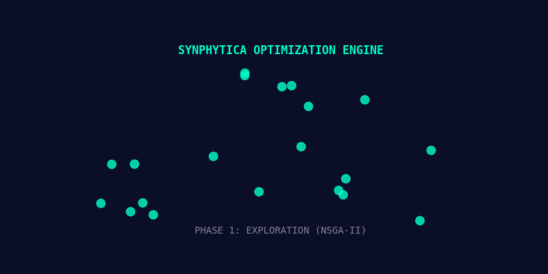

<div align="center">


[](https://colab.research.google.com/github/SH1W4/synphytica-core/blob/main/notebooks/SynPhytica_Validation.ipynb)
[](docs/en/README.md)
[](docs/pt/README.md)
[](web/)

---

[Overview](#-overview) • [Web Interface](#-synphytica-web-interface-new) • [Features](#-key-features) • [Architecture](#-neural-architecture) • [Scalability](#-scalability--multi-domain) • [Installation](#-manual-installation)

</div>

---

> 📖 **New to SynPhytica?** See the complete system walkthrough in [`docs/guides/WALKTHROUGH.md`](docs/guides/WALKTHROUGH.md) for detailed architecture, validation results, and usage examples.
>
> 🧬 **UPDATE (v0.2.0):** The **Web Interface** is now live! Experience the Neural Visualizer at `/web`.

---

## 📋 Overview

**SynPhytica** is a computational framework that bridges the gap between ancient botanical wisdom and modern artificial intelligence. By treating molecular interactions as a language, it decodes the "Entourage Effect" to design personalized formulations that maximize therapeutic efficacy while minimizing risks.

Unlike traditional drug discovery that focuses on single-molecule targets, SynPhytica embraces **Polypharmacology**—optimizing complex mixtures of compounds (Cannabinoids, Terpenes, Flavonoids) for multi-target synergy.

---

## 🚀 SynPhytica Web Interface (New)

The new frontend (`/web`) brings the mathematical core to life, offering a tactile and visual experience.

### 🌌 Neural Field Visualizer (v4.0)
An interactive physics simulation that represents the optimization process as a "living" biological system.
- **Chaos to Order**: Watch molecules organize from high entropy to Pareto-optimal clusters.
- **Chemical Inspector**: Click on particles to reveal real compound data (CBD, Limonene) via holographic cards.
- **Tactile Feedback**: The visualization reacts to mouse movement.
- **AI Agent**: An autonomous agent monitors synergy scores and creates a narrative log.

### 🪙 DeSci & Anonymous Funding
SynPhytica operates as a **Decentralized Science (DeSci)** protocol.
- **No KYC**: Support research anonymously via Crypto (BTC, ETH, SOL).
- **Direct Compute**: Funds go directly to GPU clusters.
- *Check the "Support R&D" module on the Web Interface.*

---

## ⚡ Demo: Optimization Engine

Watch the **SynPhytica Engine** evolve formulations in real-time. The animation below visualizes the 3 phases of our genetic algorithm:

1. **Exploration**: Random sampling (Green Chaos)
2. **Clusterization**: Finding synergy hotspots
3. **Pareto Convergence**: Fine-tuning to Golden Ratio (Optimal Solutions)

<div align="center">



</div>

---

## 🌟 Key Features

| Feature | Description |
| :--- | :--- |
| **🧠 Transformer Core** | Uses Self-Attention mechanisms to model non-linear molecular synergies. |
| **🧬 Multi-Objective** | Simultaneously optimizes for Efficacy, Safety, and Patient Preferences (NSGA-II). |
| **🔍 Explainable AI** | "Glass-box" approach allowing visualization of attention weights (Synergy Heatmaps). |
| **🛡️ Uncertainty UQ** | Monte Carlo Dropout quantification to ensure safety-first predictions. |
| **🌿 Plant-Agnostic** | Designed for Cannabis, but adaptable to TCM, Ayurveda, and Amazonian flora. |

---

## 🧠 Neural Architecture

The heart of SynPhytica is a **Dual-Attention Transformer**. It processes the chemical profile of the plant and the biological profile of the patient to predict outcomes (Efficacy vs Risk).

<div align="center">

*Bio-Digital Fusion: Neural Networks decoding Plant Intelligence*
</div>

---

## 🌍 Scalability & Multi-Domain

While **Medicinal Cannabis** is our primary validation case, the SynPhytica Engine is designed to decode the complexity of *any* botanical system.

### 🚀 Target Domains
1.  **🇧🇷 Brazilian Biodiversity (Amazon/Cerrado)**: Copaíba, Andiroba, Açaí.
2.  **🇨🇳 Traditional Chinese Medicine (TCM)**: *Panax ginseng*, *Astragalus*.
3.  **🇮🇳 Ayurveda**: Ashwagandha, Curcumin.

---

## 🐳 Docker (Recommended for Devs)

Run the entire environment with a single command:

```bash
docker-compose up --build
```

---

## 💻 Manual Installation

### 1. Core Engine (Python/Rust)

```bash
# Clone
git clone https://github.com/SH1W4/synphytica-core.git
cd synphytica-core

# Setup Venv
python -m venv venv
source venv/bin/activate  # Windows: venv\Scripts\activate

# Install
pip install -r requirements.txt
```

### 2. Web Interface (Next.js)

```bash
cd web
npm install
npm run dev
```
Access dashboard at `http://localhost:3000`.

---

## 📂 Project Structure

```text
SynPhytica/
├── 🧠 synphytica_core.py       # Core AI Engine (Transformer + Genetic Algo)
├── 🌐 web/                     # Next.js Application (Active Interface)
├── 📊 data/
│   ├── raw/                    # Raw downloads (XML, SDF)
│   ├── processed/              # Cleaned CSVs
│   └── schema/                 # Validation schemas
├── 📚 docs/
│   ├── en/                     # English Documentation
│   ├── pt/                     # Portuguese Documentation
│   └── COMPOUND_DATA_SCHEMA.md # Standards
├── 🧪 examples/                # Usage scripts
├── 🛠️ scripts/                 # ETL and Utility scripts
└── 🎨 assets/                  # Images and Visuals
```

---

## 🤝 Contributing

We welcome contributions from developers, pharmacologists, and data scientists! 
- Check [CONTRIBUTING.md](CONTRIBUTING.md) for guidelines.
- See [COMPOUND_DATA_SCHEMA.md](docs/COMPOUND_DATA_SCHEMA.md) to contribute plant data.

---

## 📜 Citation

If you use SynPhytica in your research, please cite:

```bibtex
@software{symbeon2025synphytica,
  author = {Symbeon Labs},
  title = {SynPhytica: AI-Powered Framework for Personalized Phytotherapeutic Formulation Optimization},
  year = {2025},
  publisher = {GitHub},
  version = {0.2.0-beta},
  url = {https://github.com/SH1W4/synphytica-core}
}
```

---

<div align="center">

**© 2025 Symbeon Labs** • Research & Development Division

📧 [Contact Us](mailto:contact@symbeonlabs.com)

</div>
