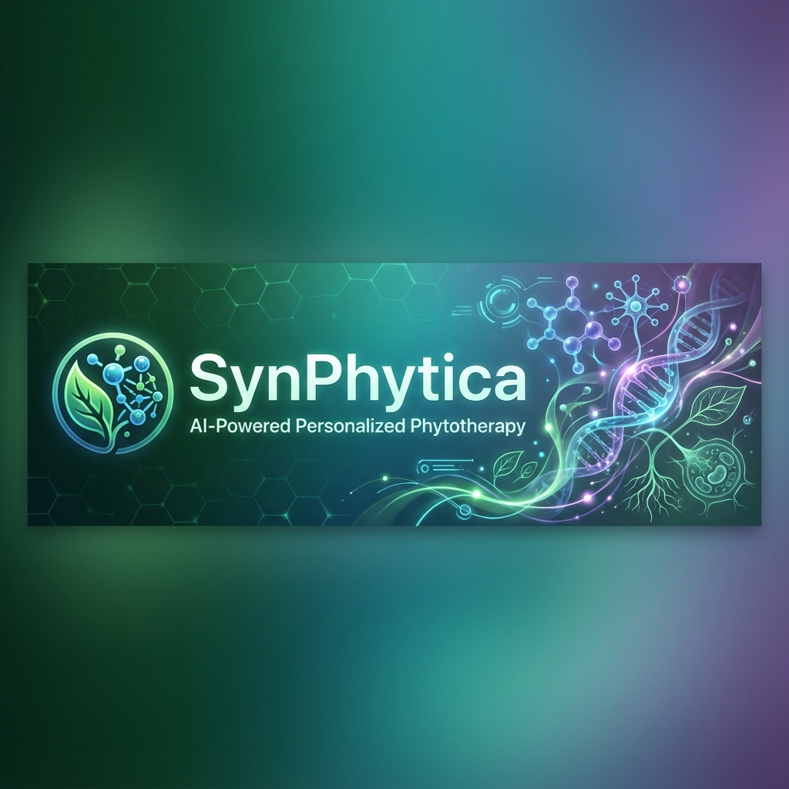
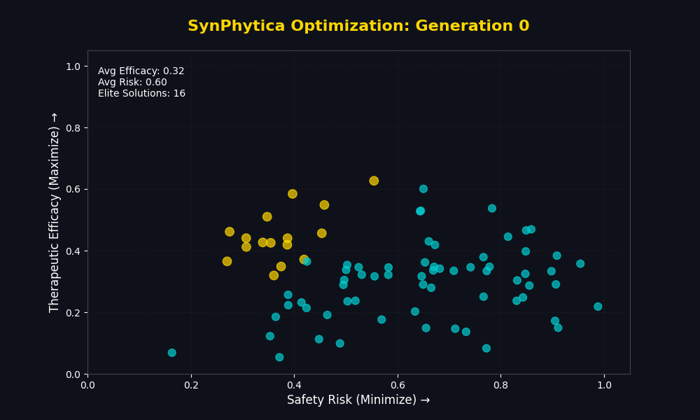
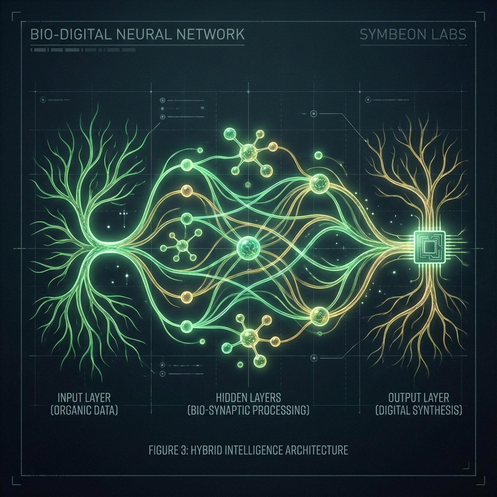

<div align="center">



[](https://colab.research.google.com/github/SH1W4/synphytica-core/blob/main/notebooks/SynPhytica_Validation.ipynb)
[](docs/en/README.md)
[](docs/pt/README.md)

---

[Overview](#-overview) • [Demo](#-demo) • [Features](#-key-features) • [Architecture](#-neural-architecture) • [Scalability](#-scalability--multi-domain) • [Installation](#-installation) • [Data](#-data-ecosystem)

</div>

---

## 📋 Overview

**SynPhytica** is a computational framework that bridges the gap between ancient botanical wisdom and modern artificial intelligence. By treating molecular interactions as a language, it decodes the "Entourage Effect" to design personalized formulations that maximize therapeutic efficacy while minimizing risks.

Unlike traditional drug discovery that focuses on single-molecule targets, SynPhytica embraces **Polypharmacology**—optimizing complex mixtures of compounds (Cannabinoids, Terpenes, Flavonoids) for multi-target synergy.

---

## ⚡ Demo

Watch the **Evolutionary Optimization Engine** in action. Starting from random combinations, the algorithm converges to the **Pareto Frontier** (Golden Points), balancing efficacy and safety over 60 generations.

<div align="center">



</div>

---

## 🌟 Key Features

| Feature | Description |
| :--- | :--- |
| **🧠 Transformer Core** | Uses Self-Attention mechanisms to model non-linear molecular synergies. |
| **🧬 Multi-Objective** | Simultaneously optimizes for Efficacy, Safety, and Patient Preferences (NSGA-II). |
| **🔍 Explainable AI** | "Glass-box" approach allowing visualization of attention weights (Synergy Heatmaps). |
| **🛡️ Uncertainty UQ** | Monte Carlo Dropout quantification to ensure safety-first predictions. |
| **🌿 Plant-Agnostic** | Designed for Cannabis, but adaptable to TCM, Ayurveda, and Amazonian flora. |

---

## 🧠 Neural Architecture

The heart of SynPhytica is a **Dual-Attention Transformer**. It processes the chemical profile of the plant and the biological profile of the patient to predict outcomes.

<div align="center">

*Bio-Digital Fusion: Neural Networks decoding Plant Intelligence*
</div>

### Mathematical Foundation
The fitness function $F(x,u)$ balances competing objectives:

$$F(x,u) = \alpha E(x,u) - \beta R(x,u) + \gamma M(x,u) - \delta P(x) - \epsilon U(x,u)$$

Where $E$ is Efficacy, $R$ is Risk, $M$ is Preference Match, $P$ is Penalty, and $U$ is Uncertainty.

---

## 🌍 Scalability & Multi-Domain

While **Medicinal Cannabis** is our primary validation case (due to data availability), the SynPhytica Engine is designed to decode the complexity of *any* botanical system.

### 🚀 Target Domains

1.  **🇧🇷 Brazilian Biodiversity (Amazon/Cerrado)**
    *   *Focus*: Copaíba, Andiroba, Açaí.
    *   *Goal*: Discovery of new anti-inflammatories and cosmetics.
2.  **🇨🇳 Traditional Chinese Medicine (TCM)**
    *   *Focus*: *Panax ginseng*, *Astragalus*.
    *   *Goal*: Modernizing ancient formulations with AI validation.
3.  **🇮🇳 Ayurveda**
    *   *Focus*: Ashwagandha, Curcumin.
    *   *Goal*: Stress reduction and cognitive enhancement blends.

---

## 🐳 Docker (Recommended for Devs)

Run the entire environment with a single command (no Python installation required):

```bash
docker-compose up --build
```

---

## 💻 Manual Installation

```bash
# 1. Clone the repository
git clone https://github.com/SH1W4/synphytica-core.git
cd synphytica-core

# 2. Create virtual environment
python -m venv venv
source venv/bin/activate  # Windows: venv\Scripts\activate

# 3. Install dependencies
pip install -r requirements.txt
```

### Quick Usage

```python
from synphytica_core import SynPhyticaOptimizer, CompoundLibrary, UserProfile

# Load library and define user
library = CompoundLibrary.from_csv('data/processed/compounds_parsed.csv')
user = UserProfile(goals=['pain', 'anxiety'], risk_tolerance=0.2)

# Run optimization
optimizer = SynPhyticaOptimizer(library, user)
results = optimizer.optimize()

print(results.pareto_front[0].summary())
```

---

## 📂 Project Structure

```text
SynPhytica/
├── 🧠 synphytica_core.py       # Core AI Engine (Transformer + Genetic Algo)
├── 📊 data/
│   ├── raw/                    # Raw downloads (XML, SDF)
│   ├── processed/              # Cleaned CSVs for training
│   ├── templates/              # Public contribution templates
│   └── schema/                 # Validation schemas
├── 📚 docs/
│   ├── en/                     # English Documentation (Primary)
│   ├── pt/                     # Documentação em Português
│   └── COMPOUND_DATA_SCHEMA.md # Data Contribution Standard
├── 🧪 examples/                # Usage scripts
├── 🛠️ scripts/                 # ETL and Utility scripts
└── 🎨 assets/                  # Images and Visuals
```

---

## 📊 Data Ecosystem

SynPhytica operates on a hybrid data model:

1.  **Open Standard**: We provide [public schemas](docs/COMPOUND_DATA_SCHEMA.md) for community contribution.
2.  **Proprietary Vault**: High-value curated datasets (e.g., specific strain genetics) are kept secure.
3.  **Federated Learning**: Future capability to train on partner data without exposing raw IP.

---

## 🤝 Contributing

We welcome contributions from developers, pharmacologists, and data scientists! 

- Check [CONTRIBUTING.md](CONTRIBUTING.md) for guidelines.
- See [COMPOUND_DATA_SCHEMA.md](docs/COMPOUND_DATA_SCHEMA.md) to contribute plant data.

---

## 📜 Citation

If you use SynPhytica in your research, please cite:

```bibtex
@software{symbeon2025synphytica,
  author = {Symbeon Labs},
  title = {SynPhytica: AI-Powered Framework for Personalized Phytotherapeutic Formulation Optimization},
  year = {2025},
  publisher = {GitHub},
  url = {https://github.com/SH1W4/synphytica-core}
}
```

---

<div align="center">

**© 2025 Symbeon Labs** • Research & Development Division

📧 [Contact Us](mailto:contact@symbeonlabs.com)

</div>
