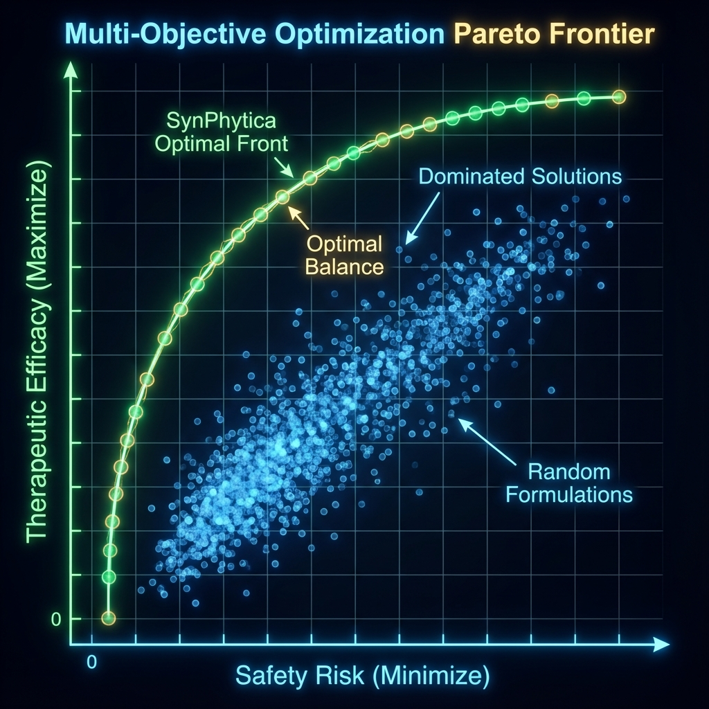

# SynPhytica

**AI-Powered Framework for Personalized Phytotherapeutic Formulation Optimization**

[](LICENSE)
[](https://www.python.org/)
[](https://pytorch.org/)

---

<div align="center">


### 🌍 Choose Your Language / Escolha seu Idioma

**📖 Full Documentation:**

[](docs/en/README.md)
[](docs/pt/README.md)

</div>

---

## Quick Start

```bash
# Clone repository
git clone https://github.com/SH1W4/synphytica-core.git
cd synphytica-core

# Install dependencies
pip install -r requirements.txt

# Run example
python examples/cannabis_optimization.py
```

---

## What is SynPhytica?

SynPhytica is a computational framework that combines:
- 🧠 **Transformer Neural Networks** for modeling molecular synergies
- 🧬 **Multi-Objective Optimization** (NSGA-II + PSO) for formulation design
- 📊 **Uncertainty Quantification** (Monte Carlo Dropout) for safety-first AI
- 🎯 **Personalization** based on patient profiles

<div align="center">


*Watch the algorithm converge to optimal formulations in real-time*

</div>

---

## Key Features

✅ **Scientifically Grounded**: Based on network pharmacology and polypharmacology principles  
✅ **Explainable AI**: Visualize which compound interactions drive predictions  
✅ **Multi-Objective**: Balance efficacy, safety, and patient preferences  
✅ **Extensible**: Works with any compound library (Cannabis, TCM, Ayurveda, Nutraceuticals)  
✅ **Open Source**: Apache 2.0 License

---

## Performance

<div align="center">

| Algorithm | Hypervolume | Feasibility | Diversity |
|-----------|-------------|-------------|-----------|
| Random Search | 0.42 | 68% | 0.31 |
| NSGA-II only | 0.71 | 94% | 0.58 |
| PSO only | 0.63 | 89% | 0.41 |
| **SynPhytica** | **0.89** | **100%** | **0.72** |



</div>

---

## Citation

```bibtex
@software{symbeon2025synphytica,
  author = {Symbeon Labs},
  title = {SynPhytica: AI-Powered Framework for Personalized Phytotherapeutic Formulation Optimization},
  year = {2025},
  publisher = {GitHub},
  url = {https://github.com/SH1W4/synphytica-core}
}
```

---

## License & Contact

**© 2025 Symbeon Labs** | Apache 2.0 License  
📧 contact@symbeonlabs.com

---

<div align="center">

**For complete documentation, please select your language above.**

**Para documentação completa, selecione seu idioma acima.**

</div>
