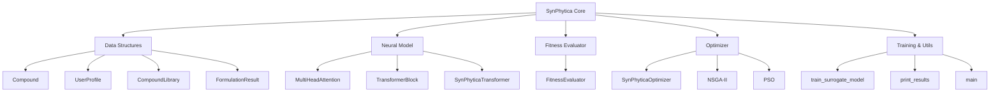

# SynPhytica Core - Code Outline

## 📊 File Statistics
- **Total Lines**: 1,286
- **Total Size**: 48.7 KB
- **Total Outline Items**: 50
- **Language**: Python

## 🏗️ Architecture Overview



---

## 📦 Section 1: Data Structures (Lines 1-398)

### Classes

#### `Compound` (Lines 62-123)
Represents a bioactive compound with pharmacological attributes.

**Attributes:**
- `name`: Compound identifier
- `therapeutic_indications`: Dict mapping indication names to efficacy scores [0,1]
- `adverse_effects`: Dict mapping effect names to risk scores [0,1]
- `organoleptic`: Dict with taste/aroma descriptors
- `cost_per_mg`: Economic cost

**Methods:**
- `to_vector(indication_list, effect_list)` → Feature vector representation

---

#### `UserProfile` (Lines 126-166)
Patient/user preferences and constraints.

**Attributes:**
- `therapeutic_goals`: Dict mapping indications to importance weights [0,1]
- `risk_sensitivities`: Dict mapping adverse effects to sensitivity [0,1]
- `budget_constraint`: Maximum cost
- `organoleptic_preferences`: Taste/aroma preferences
- `demographic`: Dict with user metadata

**Methods:**
- `to_vector(indication_list, effect_list)` → Feature vector representation

---

#### `CompoundLibrary` (Lines 169-338)
Manages a collection of bioactive compounds.

**Methods:**
- `__init__(compounds)` - Initialize library
- `_build_indices()` - Build internal indices for fast lookup
- `add_compound(compound)` - Add a compound to library
- `get_compound_matrix()` → Matrix of shape (n_compounds, feature_dim)
- `size()` → Number of compounds
- `from_csv(filepath)` - Load from CSV file
- `create_synthetic_cannabis_library()` → CompoundLibrary with 52 compounds

---

#### `FormulationResult` (Lines 341-398)
Represents an optimized formulation with metadata.

**Attributes:**
- `doses`: Array of compound doses
- `fitness`: Overall fitness score
- `efficacy_score`: Therapeutic efficacy
- `risk_score`: Adverse effect risk
- `cost`: Total formulation cost
- `metadata`: Additional information

**Methods:**
- `summary(library, top_n=10)` → Human-readable summary

---

## 🧠 Section 2: Neural Surrogate Model (Lines 399-620)

### Classes

#### `MultiHeadAttention` (Lines 405-450)
Multi-head attention mechanism.

**Methods:**
- `__init__(d_model, n_heads, dropout=0.1)`
- `forward(query, key, value, mask=None)`

---

#### `TransformerBlock` (Lines 453-482)
Single transformer block with self-attention and feed-forward.

**Methods:**
- `__init__(d_model, n_heads, d_ff, dropout=0.1)`
- `forward(x, mask=None)`

---

#### `SynPhyticaTransformer` (Lines 485-620)
**Main Neural Model** - Transformer-based surrogate for formulation prediction.

**Architecture:**
1. Compound embedding layer
2. Self-attention layers (learn compound synergies)
3. User context integration
4. Multi-task prediction heads (efficacy + risk)

**Methods:**
- `__init__(compound_dim, user_dim, d_model=128, n_heads=8, n_layers=4, ...)`
- `forward(compound_features, user_features, apply_dropout=False)` → (efficacy_pred, risk_pred)
- `mc_dropout_predict(compound_features, user_features, n_samples=20)` → Uncertainty quantification

---

## 📈 Section 3: Fitness Evaluation (Lines 622-770)

#### `FitnessEvaluator` (Lines 622-770)
Multi-objective fitness function for formulation evaluation.

**Fitness Formula:**
```
F(x,u) = αE(x,u) - βR(x,u) + γM(x,u) - δP(x) - εU(x,u)
```

Where:
- E = Efficacy
- R = Risk
- M = Preference match
- P = Constraint penalty
- U = Uncertainty

**Methods:**
- `__init__(model, library, alpha=0.6, beta=0.3, gamma=0.5, delta=0.2, epsilon=0.1)`
- `evaluate(doses, user)` → (fitness, details)
- `_preference_match(doses_norm, user)` → Organoleptic score
- `_constraint_penalty(doses, user)` → Penalty for violations

---

## 🔬 Section 4: Hybrid Optimizer (Lines 771-1065)

#### `SynPhyticaOptimizer` (Lines 777-1065)
**Main Optimization Engine** - Hybrid NSGA-II + PSO.

**Algorithm:**
1. Initialize population (random + seeded)
2. NSGA-II for exploration (genetic algorithm)
3. PSO for exploitation (particle swarm)
4. Pareto front extraction

**Methods:**
- `__init__(library, model, user_profile, population_size=100, n_generations=50, ...)`
- `initialize_population()` → Random + seeded individuals
- `evaluate_population(population)` → Fitness scores
- `update_pareto_front(population, fitnesses, details_list)` → Non-dominated solutions
- `tournament_selection(population, fitnesses, k=3)` → Parent selection
- `blend_crossover(parent1, parent2, alpha=0.5)` → BLX-α crossover
- `gaussian_mutation(individual, sigma=0.1)` → Mutation operator
- `pso_refine(individuals, n_iterations=10)` → PSO refinement
- `optimize()` → **Main optimization loop** → List[FormulationResult]
  - Nested: `run_validations()` - SEVE ethical validation

---

## 🛠️ Section 5: Training & Utilities (Lines 1066-1210)

### Functions

#### `train_surrogate_model()` (Lines 1072-1196)
Train the neural surrogate model on synthetic data.

**Parameters:**
- `library`: CompoundLibrary
- `n_samples=1000`: Training samples
- `epochs=20`: Training epochs
- `batch_size=32`: Batch size
- `device='cpu'`: Compute device

**Returns:** Trained SynPhyticaTransformer model

---

#### `print_results()` (Lines 1199-1210)
Print top formulations from Pareto front.

**Parameters:**
- `pareto_front`: List[FormulationResult]
- `library`: CompoundLibrary
- `top_n=5`: Number of results to display

---

## 🚀 Section 6: Main Execution (Lines 1211-1286)

#### `main()` (Lines 1217-1281)
**Main execution pipeline:**

1. Create synthetic cannabis library (52 compounds)
2. Define user profile (chronic pain, anxiety)
3. Train surrogate model
4. Run optimization
5. Print results
6. Optional: SEVE ethical validation

---

## 🔑 Key Features

### Neural Architecture
- **Transformer-based** surrogate model
- **Multi-head attention** for compound synergy learning
- **Monte Carlo Dropout** for uncertainty quantification

### Optimization
- **Hybrid NSGA-II + PSO** algorithm
- **Multi-objective** fitness (efficacy, risk, cost, preferences)
- **Pareto front** extraction for multiple optimal solutions

### Validation
- **SEVE Framework** integration for ethical validation
- **Constraint checking** (budget, dosage limits)
- **Uncertainty quantification** via MC Dropout

### Data
- **52 Cannabis compounds** (9 cannabinoids + 43 terpenes)
- **18 therapeutic indications**
- **12 adverse effects**
- **Extensible** via CSV import

---

## 📝 Usage Example

```python
from synphytica_core import *

# 1. Create library
library = CompoundLibrary.create_synthetic_cannabis_library()

# 2. Define user
user = UserProfile(
    therapeutic_goals={"chronic_pain": 0.9, "anxiety": 0.7},
    risk_sensitivities={"psychoactivity": 0.8},
    budget_constraint=150.0
)

# 3. Train model
model = train_surrogate_model(library, n_samples=1000, epochs=20)

# 4. Optimize
optimizer = SynPhyticaOptimizer(library, model, user)
pareto_front = optimizer.optimize()

# 5. View results
print_results(pareto_front, library, top_n=5)
```

---

## 🎯 Integration Points

### Web Interface
- `web/src/components/OptimizationVisualizer.tsx` - Calls Python backend
- `web/src/app/page.tsx` - Main UI

### Smart Contracts
- `contracts/src/GhostFundDonation.sol` - Funding mechanism
- `contracts/src/GhostFundPatronSeal.sol` - NFT rewards

### Documentation
- `docs/scientific/SynPhytica_Whitepaper_v0.2.0.md` - Technical paper
- `README.md` - Project overview
