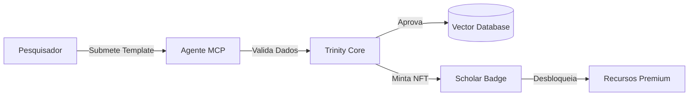

# 🔬 SynPhytica Collaborative Science Program

Bem-vindo ao protocolo de Ciência Descentralizada (DeSci) da SynPhytica.
Aqui, sua contribuição intelectual é tokenizada, imutável e recompensada.

## O Ciclo da Descoberta

A SynPhytica não é apenas um software, é um organismo vivo alimentado por dados globais. Nós incentivamos labs e pesquisadores a enriquecer nossa base de conhecimento.

## 🏆 Gamificação: "Path of the Piper"

Ao contribuir com dados validados (novas espécies, perfis químicos raros), você evolui seu nível de acesso na plataforma.

### 1. Nível: Initiate (Acesso Gratuito)
- **Requisito:** Login com Carteira/ORCID.
- **Benefício:** Acesso ao Visualizador Neural Básico.
- **Badge:** Nenhum.

### 2. Nível: Contributor (Obreiro da Ciência)
- **Requisito:** Submeter 1 Espécie Validada (via `SPECIES_CONTRIBUTION_TEMPLATE.md`).
- **Benefício:** 
    - Acesso à API do GhostFund.
    - 10 Otimizações Genéticas/mês no Neural Core.
- **Recompensa:** NFT **"SynPhytica Data Node"** (SBT - Soulbound).

### 3. Nível: Scholar (Mestre do Conhecimento)
- **Requisito:** 10+ Espécies Validadas ou 1 Paper publicado com dados SynPhytica.
- **Benefício:** 
    - Acesso ilimitado ao Evolution Engine.
    - Direito de voto na DAO de curadoria de dados.
    - Revenue Share (futuro) sobre licenciamento de dados.
- **Recompensa:** NFT **"SynPhytica Architect"** (Gold Tier).

---

## 🛠 Como Contribuir

1. **Baixe o Template:**
   Copie o arquivo `templates/research/SPECIES_CONTRIBUTION_TEMPLATE.md`.

2. **Preencha os Dados:**
   Use dados brutos de seus espectrômetros de massa ou cromatografia. O Frontmatter YAML deve ser preciso.

3. **Submeta via Pull Request:**
   Envie seu arquivo para a pasta `data/submissions/`.
   
4. **Validação Automática:**
   Nosso Agente MCP irá ler o PR. Se a assinatura química bater com as leis da física e termodinâmica, o PR é aprovado.

5. **Claim:**
   Vá até a aba "CLAIM" do componente GhostFund no dashboard e insira o Hash do seu Commit aprovado para receber seu Badge.

---

**SynPhytica:** Construindo a Biblioteca de Alexandria da Botânica Molecular.
