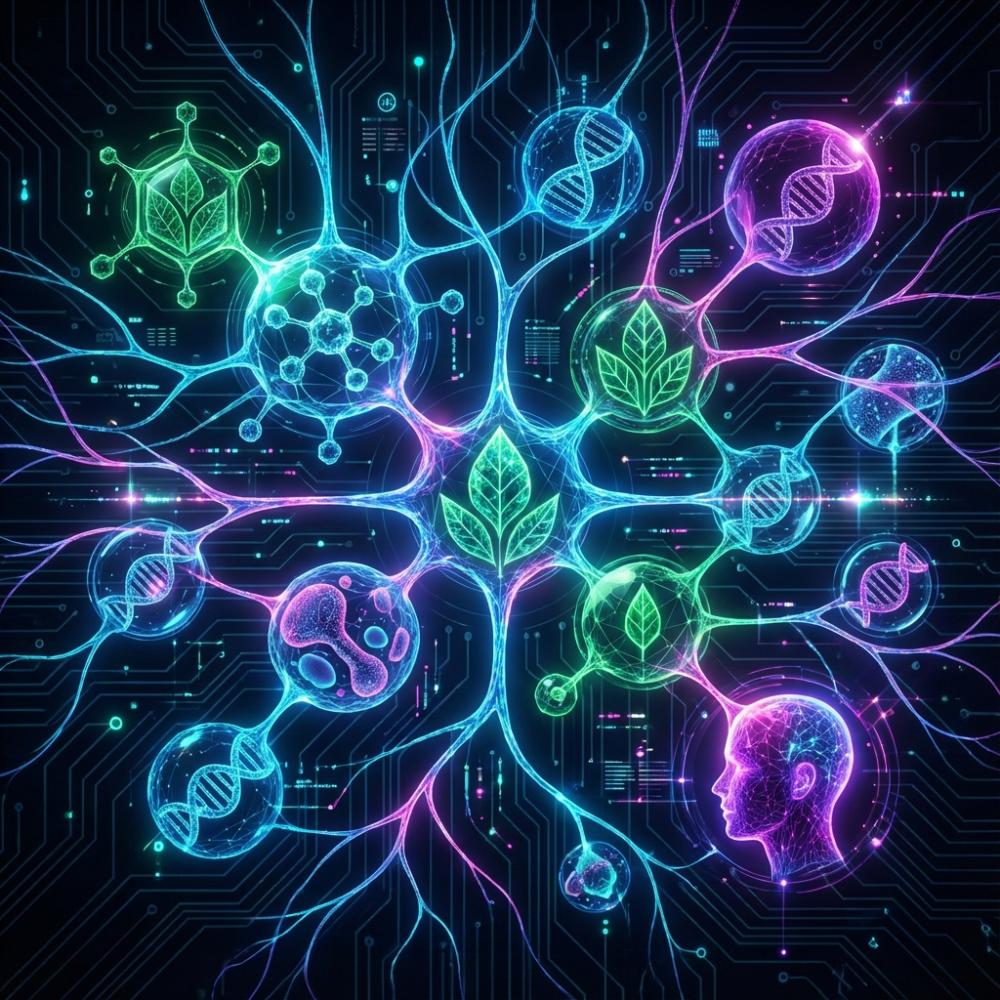
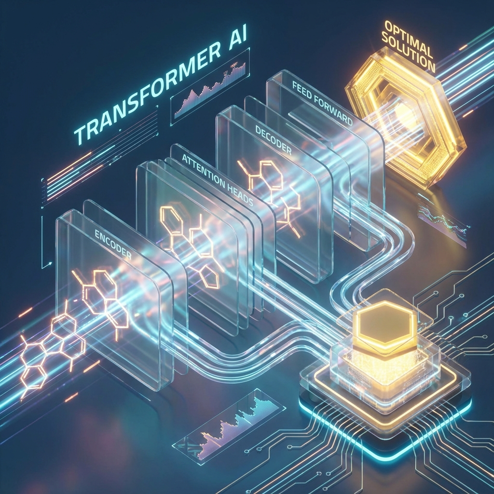

# Além do "Uma Droga, Um Alvo": Como a IA Generativa está Reescrevendo a Farmacologia de Precisão

**Autor:** Symbeon Labs  
**Data:** 30 de Novembro de 2025  
**Leitura:** 5 min

---

A farmacologia moderna foi construída sobre um dogma reducionista: para curar uma doença, encontre um alvo biológico (uma proteína, um receptor) e desenhe uma molécula ("bala mágica") para atingi-lo. Esse modelo salvou milhões de vidas, mas atingiu um muro de complexidade.

Doenças crônicas, dor, ansiedade e inflamação raramente têm uma única causa. E as ferramentas mais antigas da humanidade para tratá-las — as plantas medicinais — nunca funcionaram com uma única molécula.

A Cannabis, a Medicina Tradicional Chinesa e o Ayurveda funcionam através de **Polifarmacologia**: dezenas de compostos atuando em sinergia, onde o todo é maior que a soma das partes (o famoso "Efeito Entourage").

O problema? **A mente humana não consegue calcular sinergias de 50 compostos simultaneamente.** A tentativa e erro é lenta, cara e imprecisa.

É aqui que entra o **SynPhytica**.

## O Que Construímos: Uma "Engine" de Sinergia

O SynPhytica (v0.2.0-beta) não é apenas um recomendador. É uma plataforma de **Engenharia Farmacêutica Híbrida**. Nós paramos de tentar "adivinhar" a melhor formulação e passamos a "computar" a solução ótima.

### 1. O "Transformer Químico"
Assim como o ChatGPT prevê a próxima palavra que faz sentido em uma frase, o SynPhytica usa Redes Neurais (Transformers) para prever qual composto químico completa uma formulação para maximizar a eficácia terapêutica.

Ele não olha apenas para a química; ele usa mecanismos de **Atenção Cruzada (Cross-Attention)** para cruzar os dados moleculares com o **perfil genético e clínico do paciente**.

### 2. Otimização Evolutiva (A Sobrevivência da Fórmula Mais Aptas)
O espaço de combinações possíveis em uma planta como a Cannabis é da ordem de trilhões. Testar tudo em laboratório levaria séculos.

Usamos algoritmos genéticos (NSGA-II) para simular a evolução. Criamos milhares de formulações virtuais, fazemos elas "competirem" entre si e selecionamos as melhores. As "vencedoras" se reproduzem, sofrem mutações e melhoram a cada geração.

### 3. Velocidade Industrial com Rust
Para tornar isso viável, não podíamos depender apenas de Python. Na versão v0.2.0, reescrevemos o núcleo matemático de ordenação em **Rust**.

O resultado? Uma IA que consegue avaliar milhares de cenários complexos em segundos, trazendo a capacidade de processamento de supercomputadores para o laptop do pesquisador.

## O Impacto na Formulação Personalizada

O que isso significa para o paciente final e para a indústria?

### Do "Tamanho Único" para a "Impressão Digital Química"
Hoje, dois pacientes com dor crônica recebem a mesma prescrição de óleo de CBD. Mas um pode ter insônia e o outro ansiedade. Um pode metabolizar terpenos rapidamente, o outro não.

O SynPhytica gera uma **Fronteira de Pareto**: um conjunto de formulações ótimas personalizadas.
- **Paciente A**: Recebe uma fórmula rica em Mirceno (sedativo) para dor + sono.
- **Paciente B**: Recebe uma fórmula com Limoneno e THCV (energizante) para dor + foco.

### Segurança em Primeiro Lugar (Safety-First AI)
Diferente de IAs que "alucinam" respostas com confiança total, o SynPhytica implementa **Quantificação de Incerteza**. Se o modelo não tem dados suficientes sobre uma interação medicamentosa, ele **penaliza** a formulação. Ele prefere dizer "não sei" do que recomendar algo arriscado.

## O Futuro é Híbrido

Acreditamos que o futuro da medicina não é "Sintético vs. Natural". É a precisão da engenharia aplicada à complexidade da natureza.

Com o SynPhytica, estamos transformando a fitoterapia de uma "arte baseada em tradição" para uma "ciência baseada em dados". Estamos injetando um **Élan Vital Digital** na farmacologia: um impulso evolutivo capaz de criar adaptações químicas precisas para a complexidade da vida humana.

**Bem-vindos à era da Polifarmacologia Generativa.**

---
*Symbeon Labs é um laboratório de P&D focado na intersecção de Deep Tech e Ciências da Vida.*
