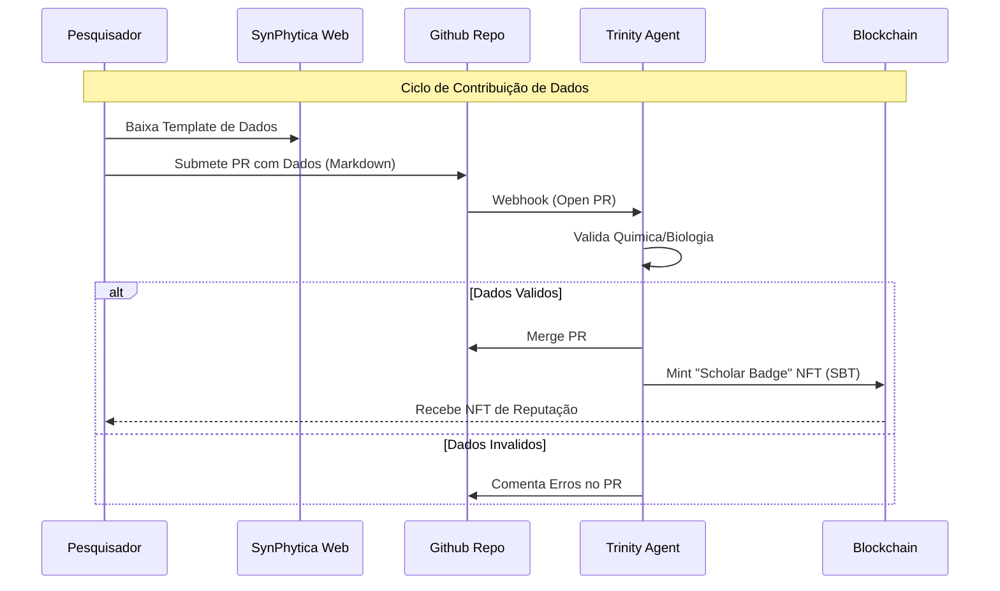

# 🌐 TASKMASH SUPERSCOPE: Operação DeSci-Sovereign

> **Status:** `ACTIVE PLANNING`
> **Versão:** 1.0
> **Objetivo:** Convergência sistêmica entre SynPhytica (IA Científica), GhostFund (Finanças) e Trinity (Orquestração).

---

## 🏗️ 1. INFRAESTRUTURA ON-CHAIN (The Backbone)
*A base imutável para reputação e financiamento.*

- [ ] **1.1. Hardhat Setup & Environment**
    - [ ] Configurar `hardhat.config.ts` definitivo com suporte a Sepolia/Arbitrum.
    - [ ] Configurar `.env` seguro (Alchemy/Infura + Private Keys).
- [ ] **1.2. Contratos Core (Finalização)**
    - [ ] `GhostFundDonation.sol`: Validar cálculo de taxas (Invariante R_p(D) = D).
    - [ ] `GhostFundPatronSeal.sol`: Implementar metadados dinâmicos (SVG on-chain ou IPFS hash).
    - [ ] `GhostFundReputation.sol`: Implementar lógica de pontuação por tiers.
- [ ] **1.3. Deploy e Verificação**
    - [ ] Deploy script (`scripts/deploy.ts`).
    - [ ] Executar deploy em Testnet (Sepolia).
    - [ ] Verificar contratos no Etherscan.

## 🧠 2. TRINITY ORCHESTRATOR (The Brain)
*O elo perdido entre o Web2 (Dados/Github) e Web3 (Blockchain).*

- [ ] **2.1. Trinity Webhook Server**
    - [ ] Criar servidor Node.js/Express (ou Serverless Function) para escutar eventos.
    - [ ] Endpoint `/verify-donation`: Checa TxHash na chain -> Confirma no DB.
    - [ ] Endpoint `/validate-data`: Recebe PR do Github -> Roda IA de validação.
- [ ] **2.2. Automação de Gamificação**
    - [ ] "Watcher" do Github: Escutar PRs com label `data-submission`.
    - [ ] Parser de Template: Ler `SPECIES_CONTRIBUTION_TEMPLATE.md` e validar campos YAML.
    - [ ] Mint Trigger: Se dados válidos -> Chamar `GhostFundPatronSeal.mintScholarBadge()`.

## 🧪 3. SYNPHYTICA INTERFACE (The Skin)
*Onde o usuário humano interage com o sistema.*

- [ ] **3.1. Integração Web3 Real**
    - [ ] Configurar `wagmi` / `viem` no `src/app/layout.tsx`.
    - [ ] Conectar componente `CryptoFunding.tsx` aos contratos deployados (ler ABIs reais).
    - [ ] Substituir mock de `verifyTransaction` por chamada real ao Trinity Webhook.
- [ ] **3.2. Dashboard do Pesquisador (Scholar Dashboard)**
    - [ ] Criar página `/scholar` (protegida por carteira).
    - [ ] Exibir Badges (NFTs) possuídos.
    - [ ] Exibir status de submissões de dados.
    - [ ] Exibir créditos de computação ganhos via reputação.

## 💾 4. DADOS & CONHECIMENTO (The Soul)
*O ativo mais valioso sendo gerado.*

- [ ] **4.1. Pipeline de Ingestão**
    - [ ] Script Python (`scripts/ingest_contributions.py`) para transformar Markdown validado em vetores.
    - [ ] Inserção automática no Vector DB (Chroma/Pinecone) do SynPhytica Core.
- [ ] **4.2. Refinamento do Template**
    - [ ] Criar exemplos preenchidos ("Golden Samples") de Cannabis e Psilocybin.
    - [ ] Adicionar Schemas JSON para validação rígida (Pydantic models).

---

## 🔄 FLUXO SISTÊMICO (The Loop)

## 🚀 PRIORIDADES IMEDIATAS (Next Sprint)

1. **Configurar Ambiente Hardhat** (Trava todo o lado Web3).
2. **Setup do Trinity Webhook** (Trava a validação real).
3. **Conexão Frontend-Contrato** (Traz a realidade para a UI).
